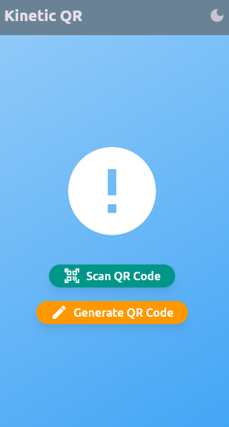
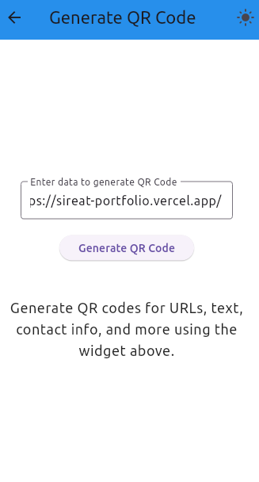
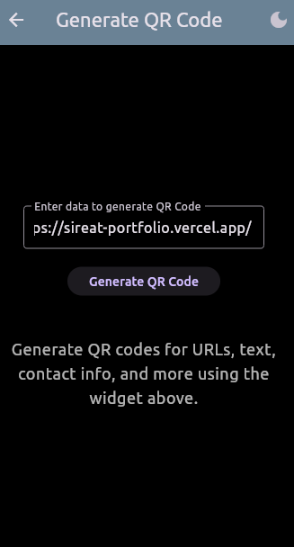

# kineticqr

A new Flutter project.

## Getting Started

This project is a starting point for a Flutter application.

## KineticQR

A Flutter application to scan and generate QR codes.

## Features

- Scan QR codes and display their content.
- Generate custom QR codes from URLs, text, contact information, and Wi-Fi details.
- Export and share generated QR codes.
- Dark mode support.
- User-friendly UI with animations.

## How to Run

1. Clone the repository.
2. Run `flutter pub get` to install dependencies.
3. Connect a device or emulator.
4. Run `flutter run` to start the app.

5. ## Code Structure

- **Core**: Handles errors and failures.
- **Data**: Implements repositories and data sources.
- **Domain**: Defines entities and use cases.
- **Presentation**: Contains UI screens, widgets, and providers.

## 6.Screenshoots

A few resources to get you started if this is your first Flutter project:

- [Lab: Write your first Flutter app](https://docs.flutter.dev/get-started/codelab)
- [Cookbook: Useful Flutter samples](https://docs.flutter.dev/cookbook)

For help getting started with Flutter development, view the
[online documentation](https://docs.flutter.dev/), which offers tutorials,
samples, guidance on mobile development, and a full API reference.
